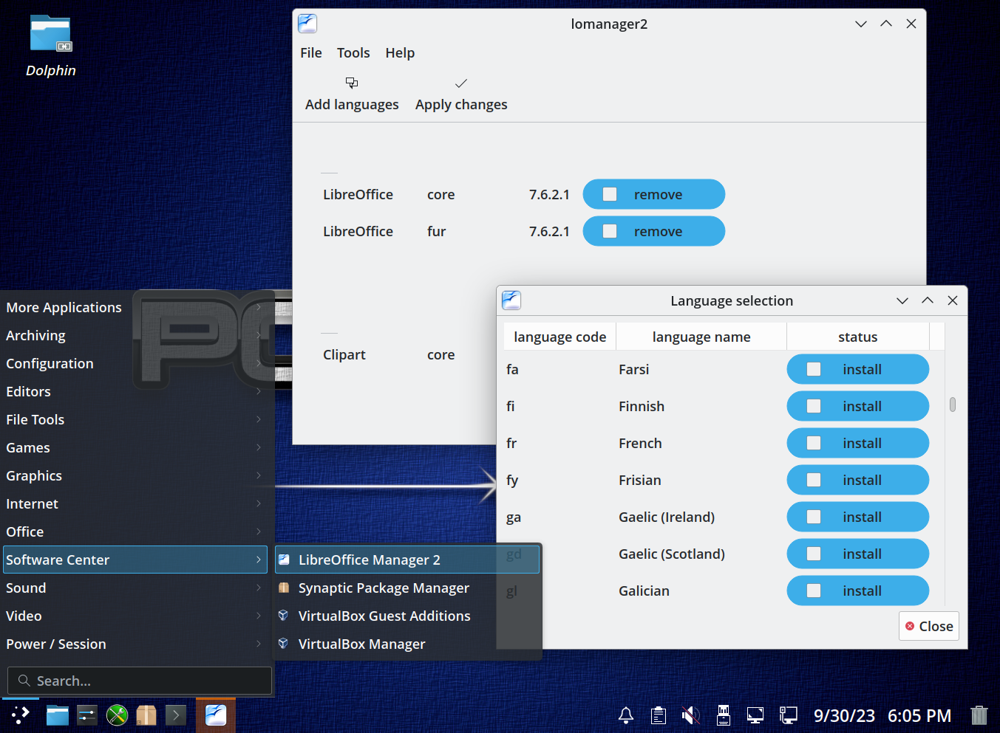

# LibreOffice Manager 2 (lomanager2)

It's a GUI application that helps manage LibreOffice suite in PCLinuxOS. It allows to easily install and remove its core package as well as any number of supported language packages. It aims to be the successor of the original *lomanager* script.

&nbsp;

&nbsp;

## WARNING

The program is not yet considered to be production ready - DO NOT USE it on your regular OS.

## Requirements and Install

lomanager2 was designed with PCLinuxOS in mind and makes assumptions about available system tools and paths. It's unlikely it will work correctly (or at all) on other distros.

### Installing an RPM package

If you want to check it out the simplest way is to download and install the prepared rpm package, it will pull all needed dependencies from PCLinuxOS repository.

### Running from source

If you want to run it directly from sources:

1. clone this repo (or download an unpack a zip archive)
2. use a console and become root by doing
   > `$ su`
3. go into the lomanager2 directory and run
   > `# python3 lomanager2`

In order for this to work you need to have the following pieces installed:

- python3
- PySide2 packages:
  - lib64pyside2-python3.10_5.15
  - lib64shiboken2-python3.10_5.15
  - python3-pyside2-core
  - python3-pyside2-gui
  - python3-pyside2-widgets
  - python3-pyside2-network
  - python3-shiboken2

If you want to see more information when the program is running start it with the `--debug` flag.

Every time the program starts it opens a new log file in the /root/.lomanager2/log directory.

## Contributing

No contributions are accepted through github at this point. All discussions concerning the future of this project take place on the PCLinuxOS forum at https://www.pclinuxos.com/forum
